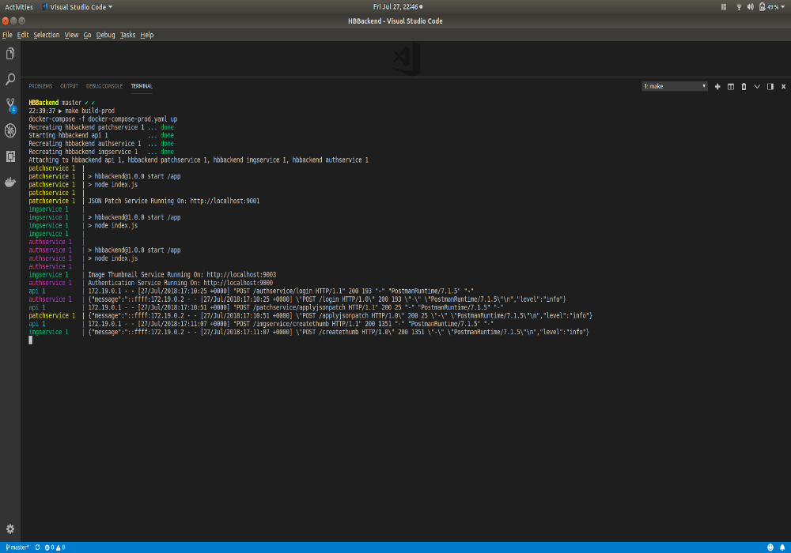
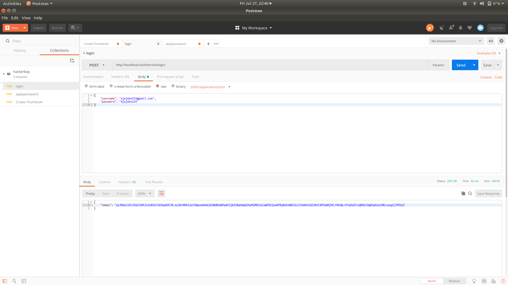
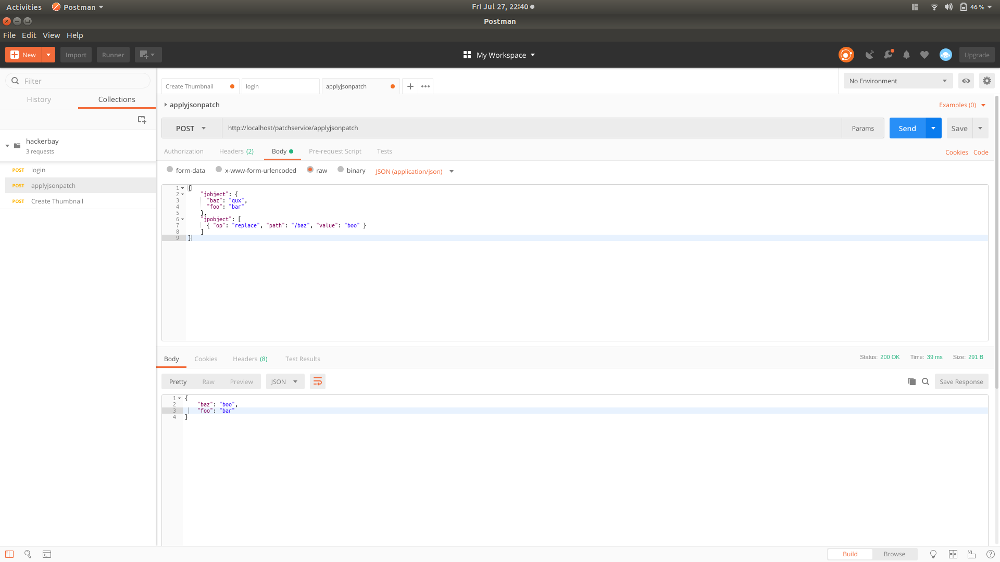
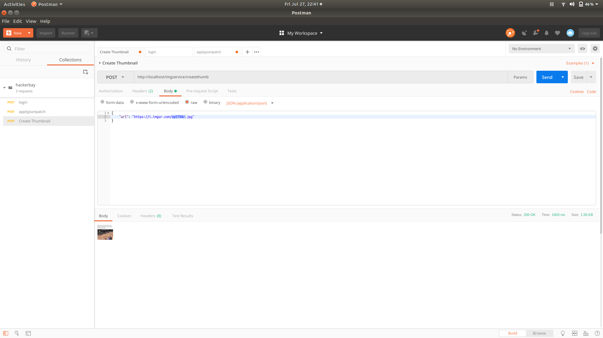

# Node Backend App

## Description

This project aims at creating stateless microservice using Node.js 

It contains mainly three services:
  - Authentication Service
    This service accepts an username which is an email and password and returns a jwt token.
  
  - JSON Patching Service
    This service accepts a json object and json patch object and returns an object after patching.

  - Image Resize Service
    This service accepts an image URL, downloads the image, resize to 50x50 and returns the resized thumbnail.

## Project Structure

Contains three services:

  - AuthenticationService

  - ImageThumbnailService

  - JSONPatchService

AuthenticationService

  - server.js: &nbsp;Runs Authentication Service
  - routes contains
  - &nbsp;&nbsp;index.js: &nbsp;Handles the '/login' route
  - test contains
  - &nbsp;&nbsp;login.spec.js: &nbsp;Contains tests for login route
  - config contains
  - &nbsp;&nbsp;auth.js: &nbsp;Contains configurations
  - &nbsp;&nbsp;winston.js: &nbsp;Contains winston setup for the service
  - Dockerfile
  - swagger.yaml: &nbsp;Contains swagger specs for Authentication Service API

JSONPatchService

  - server.js: &nbsp;Runs JSON Patch Service
  - routes contains
  - &nbsp;&nbsp;index.js: &nbsp;Handles the '/applyjsonpatch' route
  - test contains
  - &nbsp;&nbsp;jsonpatch.spec.js: &nbsp;Contains tests for applyjsonpatch route
  - config contains
  - &nbsp;&nbsp;auth.js: &nbsp;Contains configurations
  - &nbsp;&nbsp;winston.js: &nbsp;Contains winston setup for the service
  - Dockerfile
  - swagger.yaml: &nbsp;Contains swagger specs for JSON Patch Service API

ImageThumbnailService

  - server.js: &nbsp;Runs ImageThumbnail Service
  - routes contains
  - &nbsp;&nbsp;index.js: &nbsp;Handles the '/createthumb' route
  - test contains
  - &nbsp;&nbsp;createThumbnail.spec.js: &nbsp;Contains tests for createthumb route
  - config contains
  - &nbsp;&nbsp;auth.js: &nbsp;Contains configurations
  - &nbsp;&nbsp;winston.js: &nbsp;Contains winston setup for the service
  - Dockerfile
  - swagger.yaml: &nbsp;Contains swagger specs for Image Thumbnail Service API

Config contains
- &nbsp;&nbsp;nginx contains
- &nbsp;&nbsp;&nbsp;&nbsp;&nbsp;default.conf: Contains nginx configurations to handle requests to different services

Makefile

Docker-compose-prod-yaml: &nbsp;For production

Docker-compose: &nbsp;For development

## Project Architecture

- Client makes a request
- Request hits the api server which is a ngnix container
- API server routes the requests to the respective services

## Pre-requisites

- Nodejs >8
- Docker
- NPM

## Installation

- Clone the repository
- Run `make build-dev` for developement
- Run `make build-prod` for production

## Test

- Run `make test` -> This will run the linting, tests and gets the code coverage for all the services

## Base URL

`http://localhost`

## Running Services

 

## AuthenticationService

 

## JSONPatchService

 

## ImageThumbnailService

 
